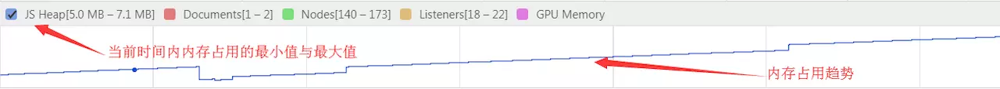

# Something About Js

[JS编码优化](#JS编码优化)

[Promise](#Promise)

[JS内存管理](#JS内存管理)


## JS编码优化
`1. 严格强类型检查`
```js
0 === false // false
0 == false // 可能会转为true
```
`2. 使用默认参数替代'||'操作`，但是默认参数并不能取代`空字符串、null`
``` js
function getName(name) {
    let firstName = name || 'Jhon'
    // ...
}
getName(null)   // Jhon
getName('')   // Jhon
getName(undefined)  // Jhon

// =============================

function getName(name = 'Jhon') {
    let firstName = name
    // ...
}
getName(null)   // null
getName('')  // 
getName(undefined)  // Jhon
```

## Promise

#### `1. 同步`
``` js
var x = true
while(x)
console.log('finish') // 不会执行该行代码
```
x为true，那么while就为死循环，同步造成 [**线程阻塞**] ，因此console将不会执行

#### `2. 异步`

可同时执行多个任务。
```js
setTimeout(function() {
    console.log('task A')
}, 0)
console.log('task B')
// while(true)
//======= console ===========
task B
task A
```
`异步任务会在当前脚本的所有同步任务执行完才会执行`，若上述代码的while取消注释了，那么setTimeout将不会执行，因为同步阻塞了进程。

#### `3. Promise基本用法`

Promise对象代表一个未完成、但预计将来会完成的操作。

注：`Promise`一旦新建就会**立即执行**，无法取消。

主要分为三种状态：

*  `pending`： 初始值，非fulfilled，也非rejected
*  `fulfilled`： 操作成功
*  `rejected`： 操作失败
```js
// 构建promise
var promise = new Promise((resolve, reject) => {
    if(true) {
        // 异步操作成功
        resolve()
    } else {
        // 异步操作失败
        reject()
    }
})

/* 写法promise.then(onFulfilled, onRejected);
 * 第二个入参非必选
 */
promise.then(function(data) {
    // 成功的操作，data为成功的结果
}, function(error) {
    // 失败的操作
})
```
`resolve` 异步操作成功后的回调，并将结果作为参数传出去；

`reject` 异步操作失败后的回调，并将结果作为参数传出去。

`4.1 .then()`

对promise添加onFulfilled和onRejected回调，并返回一个新的promise实例，且返回值将最为参数传入新的promise的resolve函数。
```js
function request(url, params, success, fail) {
     $.ajax({
        type: 'post',
        url: url,
        param: params,
        async: true,    //默认为true,即异步请求；false为同步请求
        success: success,
        error: fail
    });
}
function sendRequest(url, params) {
    return new Promise(function(resolve,reject) {
        request(url, params, resolve, reject)
    })
}
sendRequest('/getUserInfo', {}).then(data1 => {
    console.log('第一次请求成功，返回data1')
    return sendRequest('/getClassList', data1.uid).then(data2 => {
        console.log('第二次请求成功，返回data2')
    })
}).catch((err) => {
    console.log('请求失败，')
})
```

promise构造函数是同步执行的，then方法是异步执行的

```js
const promise = new Promise((resolve, reject) => {
    console.log(1);
    resolve(5)
    console.log(2);
}).then(val => {
    console.log(val);
})
promise.then(() => {
    console.log(3);
})
console.log(4);

// 执行结果：12453

```
#### `4.2 .catch()`

用于指定发生错误时的回调函数.

即promise.then(onFulfilled, onRejected)中的onFulfilled为undefined;
```js
promise.then(data => {
    console.log('success')
}).catch(err => {
    console.log('error' + err)
})

// ======== 等同于 =========

promise.then(data => {
    console.log('success')
}).catch(undefined, err => {
    console.log('error' + err)
})
```
#### `4.3 .all()`
用于将多个Promise实例，包装成一个新的。
```js
var p1 = new Promise((resolve,reject) => {
    setTimeout(()=> {
        resolve('first')
    }, 3000)
})
var p2 = new Promise((resolve,reject) => {
    resolve('second')
})
var p3 = new Promise((resolve,reject) => {
    setTimeout(()=> {
        resolve('third')
    }, 1000)
})
Promise.all([p1, p2, p3]).then((data) => {
    console.log(data)   // ["first", "second", "third"]
}).catch(err => {
    console.log(err)
})
```
#### `4.4 .race()`


## JS内存管理

#### `1. 内存生命周期`

* `内存分配:`当我们申明变量、函数、对象的时候，系统会自动为他们分配内存

```js
var s = 'asb' // 给字符串分配内存

function f(a) {
    return a + 1;
} // 给函数（可调用的对象）分配内存

someElement.addEventListener('click', function(){
  someElement.style.backgroundColor = 'blue';
}, false); // 函数表达式也能分配一个对象

// 因为字符串是不变量，
// javaScript可能不考虑分配内存，
// 只是会存储[0-3]范围的值
var s = 'ssgsg'
var s2 = s.substr(0,3) //s2是个新的字符串，只存s2
```
* `内存使用:`即读写内存，也就是使用变量、函数等
```js
var s = 'a' // 分配内存
console.log(s) // 对内存的使用
```
读取与写入可能是写入一个变量或者一个对象的属性值，甚至传递函数的参数。
* `内存回收:`内存使用完后，js根据机制自动回收不在使用的内存。但目前也不能完全智能回收所有的极端现象，那么就存在内存泄露。

局部变量：只在执行过程中存在，函数运行结束后，该变量会被标记回收（闭包情况下）；

全局变量：生命周期直至浏览器卸载才会结束，故全部变量不会被当垃圾回收。

#### `2. 垃圾回收`

* `引用`：垃圾回收算法主要依赖于引用概念，一个对象具有对它原型（隐私）和属性（显式）的引用。

垃圾回收算法：
`1). 引用计数垃圾收集`：就是看一个对象是否有指向它的引用（最初级的算法）
```js
var o = {
    a: {
        b: 0
    }
} // 两个对象被创建，一个对象1作为另外一个属性的引用，一个对象2被分配给变量o

var o2 = o // o2变量是第二个对对象2的引用

o = 1 // o另外被赋值，那么对象的原始引用o被o2代替

var oa = o2.a // 引用对象的a属性
// 那么这个对象就被oa和o2引用

o2 = 'yo' // 这里o2被重新赋值，原始的对象2为零引用,应被回收
          // 但对象的属性a被oa引用，无法回收

oa = null // oa被重新复制，对象的属性a无引用，该对象可回收
```
由上可看出，若只执行到倒数第二行代码，尽管该原始对象已无引用，但因`“循环引用”`，垃圾回收将不会执行，就会出现内存泄露。为解决该问题，现代浏览器通过标记清除算法来实现回收垃圾。

`2). 标记清除算法`：将“不再使用的对象”定义为“无法达到的对象”。及从根部（全局出发），定时扫描，无法从根部出发触及到的对象，标记为不再使用，将回收。

#### `3. 内存泄露`
1)、识别方法

* `浏览器快照查看 `

F12 > Performance > 勾选Memory > 点击左上角record > 页面操作完成后点击stop，页面将显示该时间段内的内存占用情况。




根据上图判断当前内存是否泄露：

1. 多次快照后，比较每次快照中内存占用情况，如果呈现上升趋势，可认为存在泄露；

2. 某次快照后，若内存占用走势不平稳，呈上升趋势，可认为存在内存泄露。

* `服务器环境Node的process.memoryUsage查看`
```js
console.log(process.memoryUsage())
```
process.memoryUsage返回一个对象，包含四个字段：
* rss(resident set size): 所有内存占用，包括指令区和堆栈；
* heapTotal："堆"占用的内存，包括用到的和没用到的；
* heapUsed：用到的堆的部分
* external： V8 引擎内部的 C++ 对象占用的内存

判断内存是否泄露，以`heapUsed`字段为准。

2)、内存泄露案例

* 意外的全局变量

